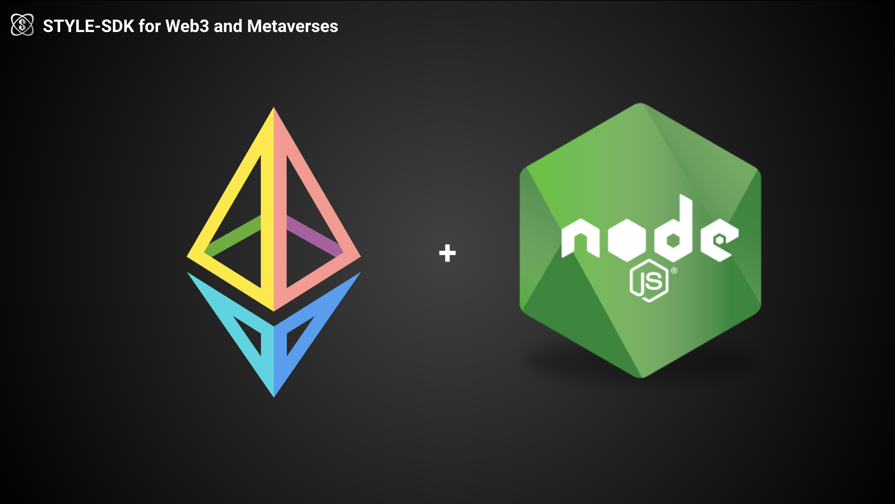
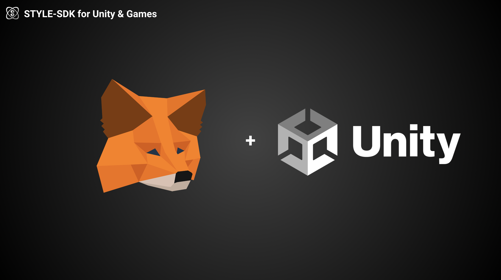
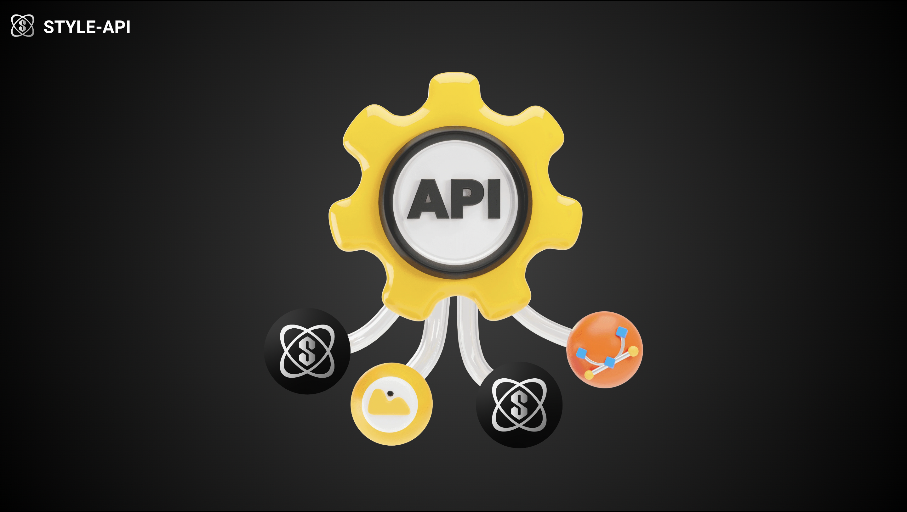
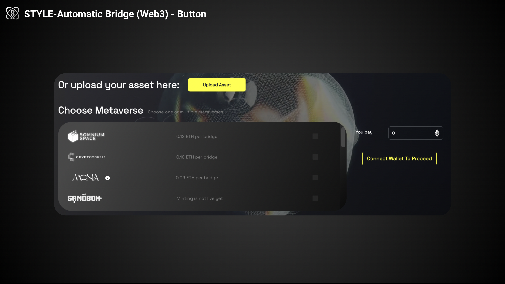

#  👋 Welcome to STYLE Tech SDKs 

 

$STYLE SDK empowers developers to build their own applications using STYLE protocol technology. It includes various SDKs, APIs, and examples that make it easy to design and build web3 applications on top of the $STYLE protocol.

# Getting Started
To use $STYLE SDKs ecosystem products you will need the following:- 
- Understand what is $STYLE protocol [Whitepaper](https://www.protocol.style/_files/ugd/87669b_a007378b197e419eb5ffb5a9d25c625c.pdf?index=true).
- At least Metaverse or Game based on Web Technology or Unity or even NFT collections already published on the mainnet.
# Our SDKs
1- [STYLE-SDK-WEB](https://github.com/STYLE-Protocol/STYLE-Protocol-SDK): 

 

The SDK integrates directly with our main smart contract to provide NFTs and assets from various metaverses using web technology. It supports both direct integration and npm packages. The requirement to integrate is a web page that supports Javascript.

2-[STYLE-SDK-Unity](https://github.com/STYLE-Protocol/STYLE-Protocol-SDK-Unity):

The SDK integrates directly with our main smart contract to provide NFTs and assets from various metaverses using C# and Unity. The requirement to integrate is a Unity package or game built using Unity

3- [STYLE-API](https://style-protocol.gitbook.io/api): 

A public API is provided to fetch NFTs and assets from our smart contract, offering fast access for developers to retrieve data directly from the blockchain. It is recommended to use the [STYLE-SDK-WEB](https://github.com/STYLE-Protocol/STYLE-Protocol-SDK) or [STYLE-SDK-Unity](https://github.com/STYLE-Protocol/STYLE-Protocol-SDK-Unity)for full integration with our main smart contract.

4- [SDK-Asset-Bridge-Button](https://www.npmjs.com/package/@style-protocol/sdk-asset-bridge-button):

The SDK can be integrated in your platform and allow you bridge any asset/NFT for any metaverse. This SDK provides full interoperability across multiple metaverses, games, NFT collections and chains.The requirment is to integrate the npm package on your existing application. 

